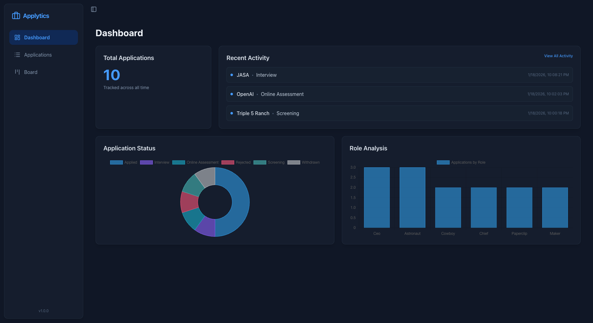

# Applytics

A modern, offline-first desktop application designed to  organize and track your job applications efficiently. Built with **React**, **TypeScript**, **Electron**, and **SQLite**.


*(Note: Screenshot to be added)*

## Features

-   **Dashboard Analytics**: Visual breakdown of your application status with interactive charts.
-   **Kanban Board**: Drag-and-drop interface to manage the lifecycle of your applications from "Applied" to "Offer".
-   **Application History**: Detailed timeline of every update for each application, including status changes and notes.
-   **Company Profiles**: View key statistics and history for specific companies.
-   **Offline First**: All data is stored locally in a SQLite database, ensuring privacy and speed.
-   **Import/Export**: Easily import existing application data (Excel/CSV support).

## Tech Stack

-   **Frontend**: React, TypeScript, Tailwind CSS, Recharts / Chart.js
-   **Backend**: Electron (Main Process), Better-SQLite3
-   **Build Tool**: Vite

## Getting Started

### Prerequisites

-   [Node.js](https://nodejs.org/) (v16 or higher recommended)
-   npm or yarn

### Installation

1.  **Clone the repository:**
    ```bash
    git clone https://github.com/yourusername/application-tracker.git
    cd application-tracker
    ```

2.  **Install dependencies:**
    ```bash
    npm install
    ```

### Running Locally

To run the application in production mode:

```bash
npm start
```

To run the application in development mode with hot-reloading:

```bash
npm run dev
```

This command runs Vite for the React frontend and launches the Electron window.

### Building for Production

To create a production build (distributable executable):

```bash
npm run build
```

The output will be located in the `dist-electron` or `release` directory depending on configuration.

## Data Storage

Your data is stored in a local SQLite database file:
-   **Development**: `tracker.db` in the project root.
-   **Production**: `tracker.db` in your system's User Data folder (e.g., `~/Library/Application Support/ApplicationTracker/` on macOS).

## License

Distributed under the GPL 3.0 License. See `LICENSE` for more information.
